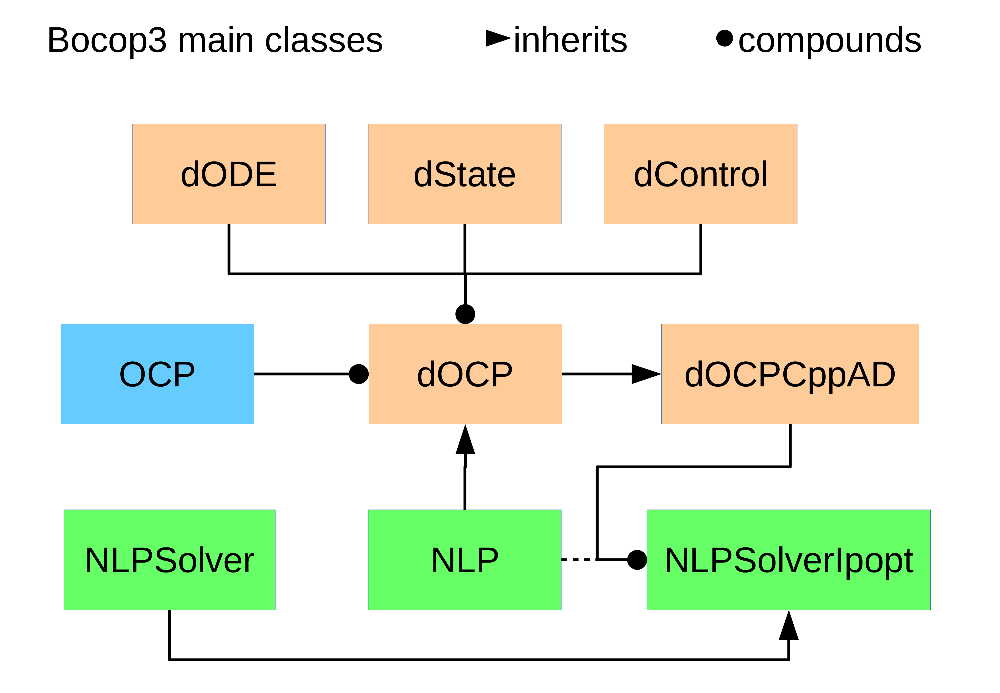

.. bocop documentation master file, created by
   sphinx-quickstart on Wed Jun 17 17:11:20 2020.
   You can adapt this file completely to your liking, but it should at least
   contain the root `toctree` directive.

Welcome to bocop's documentation!
=================================

.. toctree::
  :maxdepth: 2
  :caption: Contents:
  
  classes/OCP
  classes/dOCP
  classes/NLP
  classes/dOCPCppAD
  classes/bcp

Main classes graph
==================

Index
=====
  :ref:`genindex`

